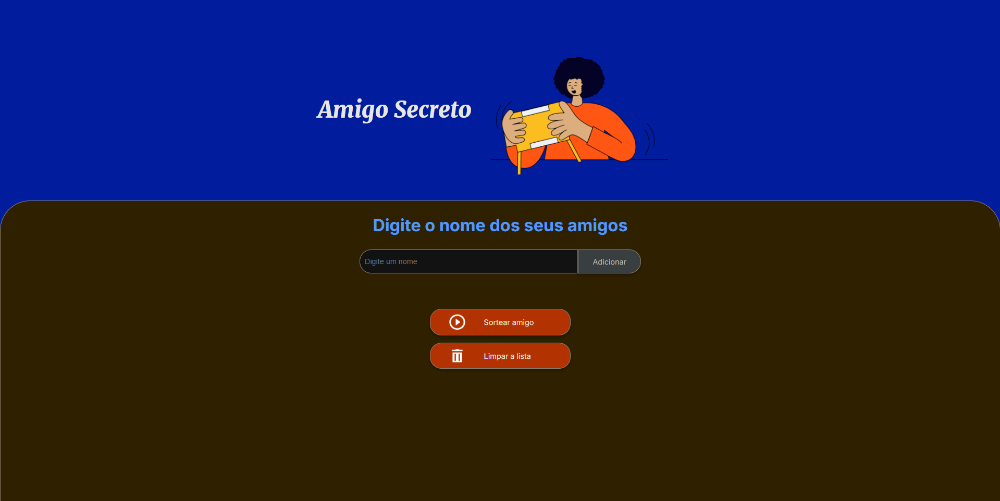

<h1 align="center"> Amigo Secreto </h1>

<h4 align="center"> Um sorteador de nomes. Adicione os nomes, sorteie aleatóriamente e veja quem ganhou. </h3>

# 🎮 Teste o projeto

<a href="https://vgabriel07.github.io/challenge-amigo-secreto_pt/" title="Jogue agora"> 🍀 Clique aqui para testar o sorteador!</a>

## :hammer: Funcionalidades do projeto
:heavy_check_mark: `Funcionalidade 1:` Adicionar nomes a lista de sorteio.

:heavy_check_mark: `Funcionalidade 2:` Sortear aleatóriamente os nomes adicionados.

:heavy_check_mark: `Funcionalidade 3:` Limpar a lista de sorteios para realizar novos sorteios.

## :robot: Demo

## 💻 Tecnologias utilizadas

---

Feito com 💙 por Victor Fortunato

